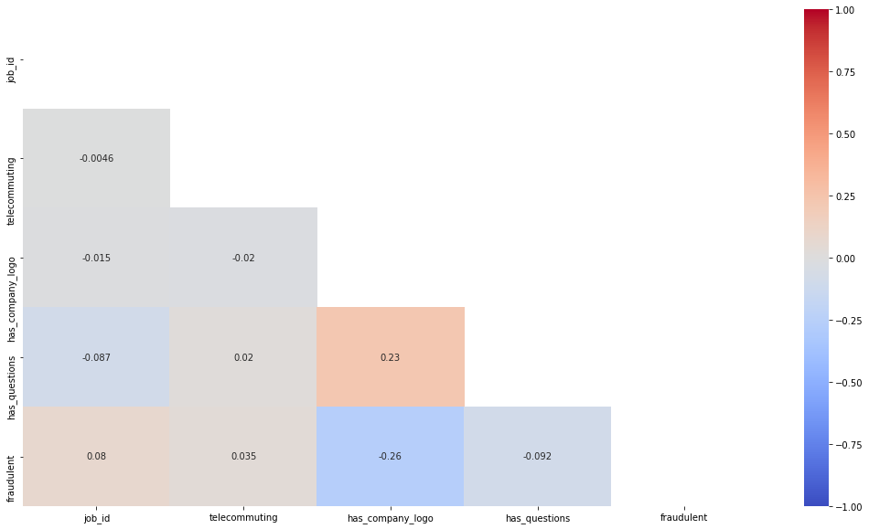
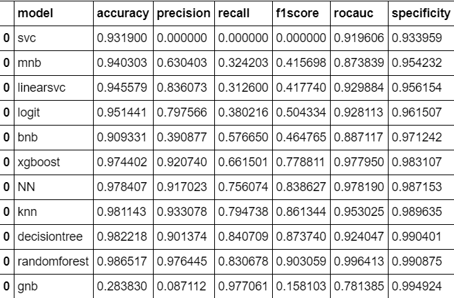

# Project Ironhack Data Bootcamp: Job offers' Fraud-Detection with NLP
**Miguel Ángel Ávalos Barrios, Javier Carrasco Morente, Miguel García Melgar and Karla Vizcarra**

*Data Analytics Part-Time, Barcelona, Dec19*

## Content
- [Project Description](#project-description)
- [Objective](#objective)
- [Dataset](#dataset)
- [Introduction](#introduction)
- [Workflow](#workflow)
  * [Exploratory Data Analysis](#exploratory-data-analysis)
  * [Preprocessing](#preprocessing)
  * [Model Training and Evaluation](#model-training-and-evaluation)
  * [Conclusion](#conclusion)
- [Future improvements](#future-improvements)
- [Tools and requirements](#tools-and-requirements)
- [Links](#links)

## Project Description
In order to experience how to work in a ML project as a group and to learn more on NLP, we have been working on a job offers' dataset so as to train a classification model able to distinguish genuine from fraudulent offers.

## Objective
We mainly wanted to create a **classification model using text data features and meta-features to predict which job descriptions are fraudulent**. As well as, finding out if there are **key traits/features** (words, entities, phrases) of job descriptions which are **intrinsically fraudulent**.

## Dataset
We used this dataset from Kaggle, [[Real or Fake] Fake JobPosting Prediction](https://www.kaggle.com/shivamb/real-or-fake-fake-jobposting-prediction), that holds around 18K job descriptions out of which about 900 are fake. The data consists of both textual information and meta-information about the jobs.

## Introduction

As said above, we've worked on a dataset of job descriptions and their meta information in which a small proportion of these descriptions were fake or scam, which can be identified by the column "fraudulent".

**Columns**:
* `job_id` Unique Job ID
* `title` The title of the job ad entry.
* `location` Geographical location of the job ad.
* `department` Corporate department (e.g. sales).f
* `salary_range` Indicative salary range (e.g. $50,000-$60,000)
* `company_profile` A brief company description.
* `description` The details description of the job ad.
* `requirements` Enlisted requirements for the job opening.
* `benefits` Enlisted offered benefits by the employer.
* `telecommuting` True for telecommuting positions.
* `has_company_logo` True if company logo is present.
* `has_questions` True if screening questions are present.
* `employment_type` Full-type, Part-time, Contract, etc.
* `required_experience` Executive, Entry level, Intern, etc.
* `required_education` Doctorate, Master’s Degree, Bachelor, etc.
* `industry Automotive` IT, Health care, Real estate, etc.
* `function Consulting` Engineering, Research, Sales etc.
* `fraudulent` **target** Classification attribute.

## Workflow
### Exploratory Data Analysis
First off all, we checked how the data looked like as well as its shape, columns and dtypes. Then we confirmed there where no nulls or duplicates.

#### Numerical columns

With the raw data we can only find a single correlationship with the target "fraudulent" that is somewhat significative:
* It seems it is slightly more common for fraudulent job offers to not contain the company logo, though the relationship is of -0.26.

*It is important to notice than those variables are actually binary categorical variables, but we'll keep calling them numerical throughout the project *

#### Categorical variables 
Here we plotted every categorical column using masked wordclouds, standing for those that were originally short pieces of text with limited variablility, plus we created a BoW of long-text categorical variables by tokenizing with SpaCy.

### Preprocessing

#### Categorical
We cleaned them and used One-Hot Encoding.

#### Numerical
Here we created a new salary range column that indicates presence or absence of salary in the previouys salary range column or listed in benefits.

#### Text
*It refers to columns of categorical variables which are whole sentences/paragraphs.*

* Those columns have been combined into 1 and have been cleaned and lemmatized, using SpaCy, to form a new BoW based on it's lemmas.
* Once cleaned we transformed the corpus of the text to a matrix using TfidfVectorizer.
* As the sparse matrix was quite big, its dimensionality was reduced using UMAP.
  
#### Merge
Enclosing preprocessing, we have merge the 3 resulting datasets from previous steps; the one with categorical variables' dummies, the numerical columns and the two dimensions resulting from UMAP. 

### Model Training and Evaluation

#### Undersampling the dataset
Due to big differences in the number of fraudulent vs non-fraudulent jobs, we used InstanceHardnessThreshold to fix imbalance through undersampling.

#### Machine Learning Models
 Few models were trained using different algorithms on the resampled dataset: 
* The algorithms used were `SVC`, `MultinomialNB`,`LinearSVC`, `LogisticRegression`, `BernoulliNB`, `GradientBoostingClassifier`,`MLPClassifier`, `KNeighborsClassifier`, `DecisionTreeClassifier`, `RandomForestClassifier`,  and `GaussianNB`.

* The table shows the results of training the different algorithms on the resampled dataset. The best results, looking for high specificities while still having high f1 scores, were obtained from MLPClassifier, KNeighborsClassifier, DecisionTreeClassifier and RandomForestClassifier.

#### Fine tuning of the best models (cambiar)
Althought the metrics of the different models are really good, we can still improve the performance of the models. Therefore, a fine tuning of the different parameters of the best models was performed.

### Conclusion (cambiar)

The model trained has an F1 Score of 0.651957, that is, this model can predict MBTI personality type 65,2% of times.

Despite not seeming particularly outstanding results, as a multiclass classification (16 types), randomness baseline was located at 6.25%. So predictions from this model would be more than 10 times more accurate than guessing.

## Future improvements (cambiar)
Future improvements would include further hyperparameter tuning, training the best couple of models using better-balanced samples and testing the resulting best model on a completely different sample.  

Ideally, I would also like to adapt it to the Big Five model, as is the personality models of the highest predictive validity. Still, adapting it/ doing a new similar model for predicting other psychological metrics out of text would be mesmerizing too.

## Tools and requirements
In order to train more models simultaneously, we've been both using Jupyter Notebooks on our own machines and also using default virtual machines with Google Colab.

We have also used the latest Conda with the last version of the following packages and libraries:
* os
* pandas
* numpy
* scipy
* math
* random
* seaborn
* matplotlib
* PIL
* wordcloud
* re
* itertools
* spacy
* en_core_web_sm
* string
* collections
* pickle
* umap
* imblearn
* sklearn 

## Links
[Repository](https://github.com/mikongame/Module-3-Project-2-ML-Fraud-Detection/tree/develop/your-code)  

[Slides](https://drive.google.com/file/d/1yxGmtVNFPa4AZYL16zA0mP8AgQVconof/view?usp=sharing) cambiar
